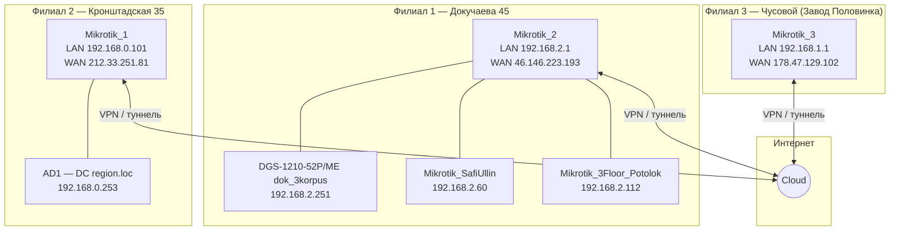
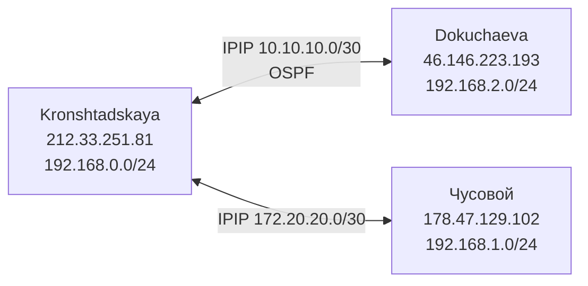

# Документация сети — филиалы и оборудование

---

## Схема сети (3 филиала)

Три площадки связаны **через Интернет** (site-to-site VPN или туннели между MikroTik). Каждый филиал — отдельная локальная подсеть со своим шлюзом.



### Описание топологии

| Филиал | Шлюз (MikroTik) | Локальная подсеть | Публичный IP | Расположение |
|--------|-----------------|-------------------|--------------|--------------|
| **1. Докучаева** | Mikrotik_2 | **192.168.2.0/24** | 46.146.223.193 | Докучаева 45, 1 этаж, помещение приёма пищи |
| **2. Кронштадская** | Mikrotik_1 | **192.168.0.0/24** | 212.33.251.81 | Кронштадская 35, 1 этаж, бывш. серверная |
| **3. Чусовой** | Mikrotik_3 | **192.168.1.0/24** | 178.47.129.102 | Завод Половинка, старый штаб |

Связь между филиалами — **IPIP-туннели** через Интернет (подробнее в разделе «Конфигурация MikroTik»).

### Оборудование внутри филиала Докучаева (192.168.2.0/24)

| Устройство | IP | Роль |
|------------|-----|------|
| **Mikrotik_2** | 192.168.2.1 | Шлюз, DHCP, маршрутизация, VPN |
| **DGS-1210-52P/ME** (dok_3korpus) | 192.168.2.251 | L2-коммутатор (VLAN 1 + VLAN 2) |
| **Mikrotik_SafiUllin** | 192.168.2.60 | База, 2 корпус, 2 этаж (Сафиуллин) |
| **Mikrotik_3Floor_Potolok** | 192.168.2.112 | База, 2 корпус, 3 этаж (под потолком) |

```
Интернет
   |
Mikrotik_2 (192.168.2.1) ──┬── D-Link dok_3korpus (192.168.2.251) ── порты клиентов
                           ├── Mikrotik_SafiUllin (192.168.2.60)
                           └── Mikrotik_3Floor_Potolok (192.168.2.112)
```

> Коммутатор **dok_3korpus** (192.168.2.251) находится в **филиале Докучаева**. Шлюз **192.168.2.1** = Mikrotik_2. DHCP и «разные адреса на порту» — зона ответственности **Mikrotik**, не D-Link.

### Параметры подключения к MikroTik

| Имя | LAN IP | WAN / удалённый доступ | Примечание |
|-----|--------|------------------------|------------|
| **Mikrotik_1** (Кронштадская) | 192.168.0.101 | 212.33.251.81 |  |
| **Mikrotik_2** (Докучаева) | 192.168.2.1 | 46.146.223.193 | |
| **Mikrotik_3** (Чусовой) | 192.168.1.1 | 178.47.129.102 | Winbox (стандартный порт) |
| **Mikrotik_SafiUllin** | 192.168.2.60 | — (только LAN) | Внутри сети Докучаевой |
| **Mikrotik_3Floor_Potolok** | 192.168.2.112 | — (только LAN) | Внутри сети Докучаевой |

**Удалённое подключение (Winbox / SSH):** `<публичный_IP>:порт` — для Mikrotik_1 и Mikrotik_2. Учётные данные хранятся отдельно.

---

## Конфигурация MikroTik (export от 10.06.2026)

Источники: `наш.txt` (Кронштадская), `докучаева.txt`, `половинка.txt`.

### Сводка по роутерам

| Файл | Identity | Модель | RouterOS | LAN IP | WAN |
|------|----------|--------|----------|--------|-----|
| **наш.txt** | kronshtadskaya gate | RB951G-2HnD | 7.16.2 | 192.168.0.101/24 | PPPoE ether1 → 212.33.251.81 |
| **докучаева.txt** | dokuchaeva gate | RB951G-2HnD | 7.16.2 | 192.168.2.1/24 | vlan1234 (ERTelecom) → 46.146.223.193 |
| **половинка.txt** | Zavod-Shtab | RB951G-2HnD | 7.20.4 | 192.168.1.1/24 | ether1 (RTK) → 178.47.129.102 |

### Связь между филиалами (IPIP-туннели)



| Туннель | Локальный IP | Удалённый IP | Маршрут |
|---------|--------------|--------------|---------|
| Kronshtadskaya ↔ Dokuchaeva | 10.10.10.1 / 10.10.10.2 | 212.33.251.81 ↔ 46.146.223.193 | OSPF area backbone |
| Kronshtadskaya ↔ Чусovoy | 172.20.20.2 / 172.20.20.1 | 212.33.251.81 ↔ 178.47.129.102 | Чусovoy → 192.168.0.0/24 |

### Домен Active Directory

| Сервер | IP | Филиал | Роль (из отчётов) |
|--------|-----|--------|-------------------|
| **AD1** | 192.168.0.253 | Кронштадская | DC домена **region.loc**, DNS |
| **AD2** | 192.168.2.253 | Докучаева | DNS для 192.168.2.0/24 (ether4 на Mikrotik_2) |

DHCP на Mikrotik выдаёт клиентам DNS: **192.168.0.253** + **192.168.2.253** (домен `region.loc`).

### RADIUS / 802.1X

**Нигде не настроен** — ни на D-Link, ни на MikroTik. Контроль доступа по портам и Wi‑Fi — WPA2-PSK / домен Windows, не RADIUS.

---

### Mikrotik_2 — Докучаева (главный для dok_3korpus)

#### DHCP-серверы (3 штуки)

| Имя | Интерфейс | Пул | Lease | Назначение |
|-----|-----------|-----|-------|------------|
| **dhcp1** | bridge-local | 192.168.2.2–199 | **10 мин** | Корп. сеть, домен region.loc |
| **dhcp_for_vlan2** | vlan2 | 10.109.109.2–250 | **10 мин** | 3-й корпус — **только интернет**, без доступа к 192.168.2.0 |
| **dhcp_for_vlan3** | vlan3 | 10.209.209.2–250 | **10 мин** | Принтеры для гостевой/Wi‑Fi сети |

#### VLAN на Mikrotik ↔ VLAN на D-Link dok_3korpus

| D-Link VLAN | D-Link порты | Mikrotik | Подсеть | Доступ |
|-------------|--------------|----------|---------|--------|
| **default (1)** | untagged: 1,19,21,31… | bridge-local | **192.168.2.0/24** | Домен, серверы, принтеры |
| **vlan2 (2)** | untagged: 2–16,20…; **tagged: 17–18,47–48** | vlan2 | **10.109.109.0/24** | Только интернет (изолирован от 192.168.2.0) |
| **vlan3 (3)** | — | vlan3 | **10.209.209.0/24** | Принтеры |

Правила маршрутизации на Mikrotik **блокируют** трафик между 192.168.2.0/24 и 10.109.109.0/24.

#### VPN-сервисы (Dokuchaeva)

| Сервис | Статус |
|--------|--------|
| L2TP + IPsec | Enabled |
| PPTP | Enabled |
| SSTP | Enabled |
| Winbox | порт **49091** |
| SSH | порт **49022** |

---

### Mikrotik_1 — Кронштадская

| Параметр | Значение |
|----------|----------|
| WAN | PPPoE (провайдер), публичный 212.33.251.81 |
| DHCP | 192.168.0.2–98 + 192.168.0.103–180, lease **10 мин** |
| DNS option | домен `region.loc` |
| OpenVPN | порт **14300** |
| PPTP | Enabled (+ клиент minfin → 82.208.95.220) |
| IPIP | → Dokuchaeva, → Чусovoy |

---

### Mikrotik_3 — Чусovoy (Zavod-Shtab)

| Параметр | Значение |
|----------|----------|
| WAN | 178.47.129.102/30, шлюз 178.47.129.101 |
| DHCP | 192.168.1.10–254, lease **10 мин** |
| IPIP | → Kronshtadskaya (212.33.251.81), маршрут к 192.168.0.0/24 |
| Winbox | порт **8291** (стандартный, с фильтром Allow) |

---

## Проблема «разные IP на порту» — объяснение по конфигам

**RADIUS нет.** IP выдаёт **DHCP на Mikrotik_2**.

### Порт 21 на D-Link (VLAN 1)

Порт 21 — **untagged VLAN 1** → клиенты получают адреса из **192.168.2.2–199**.

**Причина смены IP:** lease-time = **10 минут** на всех DHCP-пулах. Если нет статической резервации по MAC — адрес меняется каждые 10 минут. Это **нормальное поведение**, не ошибка коммутатора.

**Что сделать:** на Mikrotik_2 (Winbox → IP → DHCP Server → Leases) — **Make Static** для нужного MAC, или увеличить lease-time.

### Если адреса из разных подсетей (192.168.2.x и 10.109.109.x)

Устройство подключено к порту **VLAN 2** (10.109.109.x), а не VLAN 1. Или через mini-switch к нескольким VLAN — проверить `show fdb port X` на D-Link.

### Команды диагностики на Mikrotik_2

```text
/ip dhcp-server lease print where active=yes
/ip arp print
/interface bridge host print
```

---

# Отчёт по коммутатору DGS-1210-52P/ME — dok_3korpus

**Дата обследования:** 30.06.2026  
**IP управления:** 192.168.2.251  
**Модель:** D-Link DGS-1210-52P/ME (52× Gigabit + PoE, HW B1)  
**Прошивка:** 7.02.B057  

---

## 1. Общая информация

| Параметр | Значение |
|----------|----------|
| System Name | dok_3korpus |
| System Location | dok_3korpus |
| MAC Address | 00-AD-24-DE-14-D0 |
| Serial Number | S37C2IC000064 |
| Boot Version | 1.01.033 |
| Uptime (на момент опроса) | ~22 часа |

### Сеть управления

| Параметр | Значение |
|----------|----------|
| IP Address | 192.168.2.251 (статический) |
| Subnet Mask | 255.255.255.0 |
| Default Gateway | 192.168.2.1 |
| VLAN управления | default (VLAN 1) |
| Login Timeout | 5 минут |

---

## 2. Сервисы управления

| Сервис | Статус | Комментарий |
|--------|--------|-------------|
| Web (HTTP) | **Enabled** (порт 80) | Проверено: страница Login отвечает |
| Telnet | **Enabled** (порт 23) | Небезопасно — рекомендуется отключить |
| SSH | Используется | Подключение с legacy-алгоритмами |
| SNMP | **Enabled** | Мониторинг включён |
| Console | 9600 baud, logout 10 min | — |

### Протоколы L2/L3

| Функция | Статус |
|---------|--------|
| STP/RSTP | **Disabled** |
| GVRP | Disabled |
| IGMP Snooping | Disabled |
| 802.1X | **Disabled** |
| VLAN Trunk (функция D-Link) | Disabled |
| DHCP Client (на коммутаторе) | Disabled |
| Jumbo Frame | Disabled |
| Safeguard Engine | Enabled |
| Asymmetric VLAN | Disabled |

**RADIUS / 802.1X на коммутаторе не настроен** — контроль доступа по портам отсутствует. Выдача IP-адресов этим коммутатором не выполняется.

---

## 3. VLAN

Всего VLAN: **2** (из 4094).

### VLAN 1 — `default` (управление, 192.168.2.0/24)

| Параметр | Значение |
|----------|----------|
| VID | 1 |
| Untagged порты | 1, 17–19, 21, 31, 33, 39, 41–42, 44–48 |
| Tagged порты | — |

### VLAN 2 — `vlan2` (пользовательская сеть)

| Параметр | Значение |
|----------|----------|
| VID | 2 |
| Untagged порты | 2–16, 20, 22–30, 32, 34–38, 40, 43, 49–52 |
| Tagged порты | **17–18, 47–48** (trunk / uplink) |

### Схема

```
                    [Шлюз 192.168.2.1]
                            |
              [DGS-1210-52P/ME — dok_3korpus]
                   192.168.2.251 (VLAN 1)
                            |
        +-------------------+-------------------+
        |                                       |
   VLAN 1 (default)                        VLAN 2 (vlan2)
   access: 1,19,21,31,33,                  access: 2-16,20,
   39,41-42,44-46                          22-30,32,34-38,
                                            40,43,49-52
        |                                       |
        +-------- Trunk tagged VLAN 2 -----------+
                 порты 17-18, 47-48
                        |
              [Другой коммутатор / роутер]
```

**PVID auto_assign:** включён — native VLAN порта назначается автоматически по untagged-членству.

---

## 4. Состояние портов (физический уровень)

**Активные порты (Link Up):** 19–20 из 52.

| Порт | Скорость | VLAN | Роль |
|------|----------|------|------|
| 1 | 100M | VLAN 1 | Access |
| 2 | 1000M | VLAN 2 | Access |
| 8 | 100M | VLAN 2 | Access |
| 17 | 1000M | V1 + V2 tagged | Trunk + PoE |
| 18 | 1000M | V1 + V2 tagged | Trunk + PoE |
| 19 | 1000M | VLAN 1 | Access |
| 21 | 1000M | VLAN 1 | Access |
| 23 | 1000M | VLAN 2 | Access |
| 30 | 10M | VLAN 2 | Access (медленное устройство) |
| 31 | 100M | VLAN 1 | Access |
| 35 | 100M | VLAN 2 | Access |
| 37 | 100M | VLAN 2 | Access |
| 40 | 1000M | VLAN 2 | Access |
| 41 | 1000M | VLAN 1 | Access |
| 42 | 1000M | VLAN 1 | Access |
| 44 | 100M | VLAN 1 | Access |
| 45 | 100M | VLAN 1 | Access |
| 46 | 1000M | VLAN 1 | Access |
| 47 | 1000M | V1 + V2 tagged | Trunk |
| 48 | 100M | V1 + V2 tagged | Trunk |

**Порты 49–52:** SFP-слоты, Link Down.

**Остальные порты (3–7, 9–16, 20, 22, 24–29, 32–34, 36, 38–39, 43):** не подключены.

---

## 5. PoE

| Параметр | Значение |
|----------|----------|
| Power Limit | 193.0 W |
| Power Consumption | 10.5 W |
| Power Remained | 182.5 W |
| Disconnection Method | Deny low priority port |
| Legacy PD Detection | Disabled |

### Порты с активным PoE

| Порт | Статус | Мощность | Напряжение | Ток |
|------|--------|----------|------------|-----|
| **17** | POWER ON | 3.3 W | 54.1 V | 61 mA |
| **18** | POWER ON | 5.3 W | 54.0 V | 99 mA |

Суммарно на 17–18: **8.6 W**. Оставшиеся **~1.9 W** — на портах 21–48 (полный вывод PoE обрезан; на портах 1–20 кроме 17–18 питание не подаётся).

| Порт | PoE State | Примечание |
|------|-----------|------------|
| 1 | Enable, 0 W | PoE включён, устройство без PoE |
| 2 | Disable | PoE выключен на порту |
| 19 | Disable | Линк есть, PoE off |

---

## 6. Безопасность L2

| Функция | Статус |
|---------|--------|
| DHCP Snooping | Disabled |
| IP/MAC Binding | Disabled |
| Rogue DHCP Filter | Disabled |
| 802.1X / RADIUS | **Disabled** |
| Address Binding Roaming | **Enabled** |
| Traffic Segmentation | Все порты → все порты (изоляции нет) |

---

## 7. Проблема: «один порт выдаёт разные адреса»

### Что видно по конфигурации

На коммутаторе **нет RADIUS** и **нет 802.1X** — он **не выдаёт IP-адреса**. DHCP/RADIUS, если используются, находятся **на другом устройстве** (роутер 192.168.2.1, сервер, uplink-коммутатор).

Разные IP на одном порту коммутатора обычно означают одно из следующего:

| Причина | Описание |
|---------|----------|
| **Несколько устройств на одном порту** | Через неуправляемый switch/hub к одному порту подключено 2+ устройства — каждое получает свой IP по DHCP |
| **Несколько MAC на порту** | В таблице MAC (FDB) у порта будет больше одной записи |
| **Разные DHCP-серверы** | Rogue DHCP в сети или DHCP в VLAN 1 и VLAN 2 (если устройство как-то попадает в разные VLAN) |
| **Устройство с несколькими интерфейсами** | ПК с Wi‑Fi + Ethernet, VM, docker — несколько MAC/IP |
| **Roaming binding включён** | `enable address_binding roaming` — MAC может «переезжать» между портами (не объясняет разные IP на одном порту, но влияет на привязки) |
| **Переподключение / смена DHCP lease** | Один клиент при каждом подключении получает новый IP (норма для DHCP без резервации) |

### Диагностика — команды на коммутаторе

Замените `X` на номер проблемного порта:

```text
show fdb port X
show ports X
show vlan
show address_binding
show address_binding dhcp_snoop
show filter dhcp_server
```

**На роутере / DHCP-сервере (192.168.2.1 или сервер в VLAN 2):**
- журнал DHCP (leases);
- нет ли второго DHCP в той же подсети;
- резервации по MAC.

### Что проверить физически

1. К проблемному порту подключено **только одно** устройство или через **мини-switch**?
2. В каком **VLAN** порт (VLAN 1 → 192.168.2.x, VLAN 2 → другая подсеть)?
3. **Один и тот же MAC** или разные при смене IP?

### Типичное решение

| Ситуация | Действие |
|----------|----------|
| Несколько устройств через hub/mini-SW | Разнести по разным портам или использовать управляемый switch |
| Rogue DHCP | Включить `filter dhcp_server` / DHCP snooping, найти лишний сервер |
| Нужна стабильная IP одному клиенту | Резервация DHCP по MAC на роутере (не на D-Link) |
| Нужен контроль «кто на порту» | 802.1X + RADIUS (сейчас **не настроено**) |

---

## 8. Рекомендации

| Приоритет | Рекомендация |
|-----------|--------------|
| Высокий | Включить **STP/RSTP** (`enable stp`) — uplink на портах 17–18, 47–48 без защиты от петель |
| Высокий | Отключить **Telnet** (`disable telnet`), оставить SSH + Web |
| Средний | Для проблемного порта выполнить `show fdb port X` и прислать вывод |
| Средний | При необходимости IPTV/multicast — включить **IGMP Snooping** |
| Низкий | Заполнить **System Contact** для документации |
| Низкий | Рассмотреть **HTTPS** вместо HTTP (`enable ssl`, `disable web`) |

---

## 9. Подключение для администрирования

### SSH (legacy-алгоритмы)

```bash
ssh -o KexAlgorithms=diffie-hellman-group1-sha1 -o HostKeyAlgorithms=ssh-rsa -o Ciphers=3des-cbc -o MACs=hmac-sha1 <login>@192.168.2.251
```

### Web

```
http://192.168.2.251
```

### Полезные команды CLI

```text
show switch
show config current_config
show vlan
show ports
show fdb port X
show poe system
show poe ports 1-48
show iproute
show ssh server
show telnet
save
```

---

## 10. Источники данных

Отчёт составлен на основе:

- `show switch`
- `show config current_config` (частично)
- `show vlan`
- `show ports`
- `show vlan_trunk`
- `show poe system`
- `show poe ports 1-48` (порты 1–20)
- Web UI: Device Information
- Проверка доступности Web: HTTP 200 на порту 80

---

*Документ сгенерирован по результатам опроса коммутатора dok_3korpus.*
